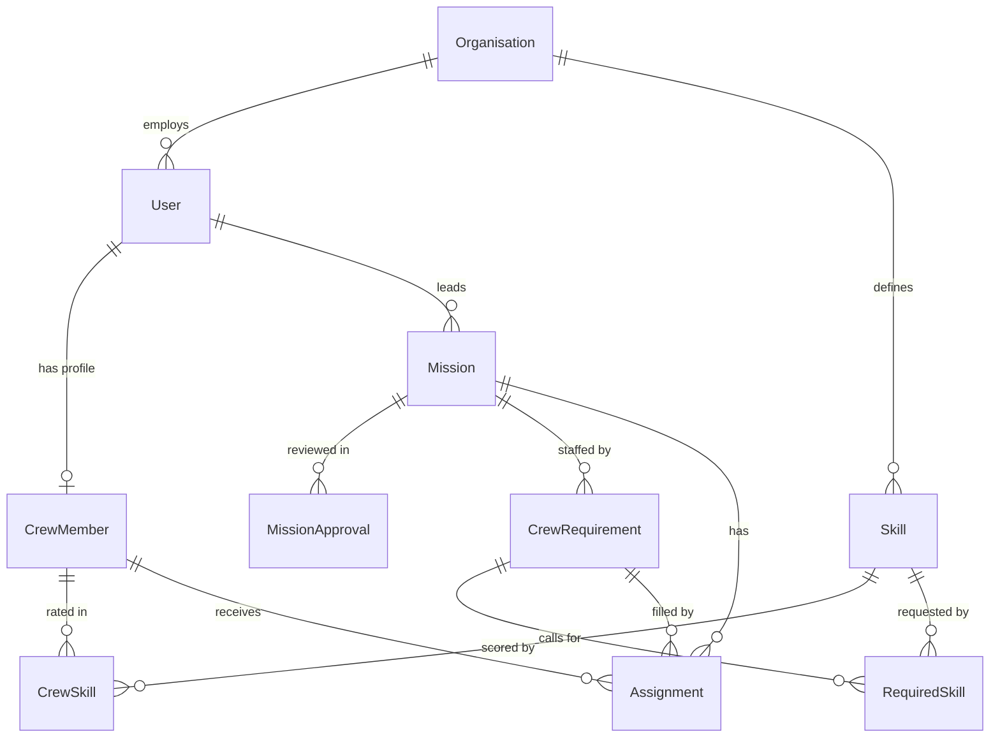

# Architecture

Mission Control is a **modular monolith**: one deployable unit, one database, one build — but
internally partitioned into modules with boundaries that are meant to be as real as if they were
separate services.

The goal is not to eventually split into microservices. It is to keep the option open while
paying none of the distributed-systems cost up front, and to stop the codebase from quietly
becoming a big ball of mud in the meantime.

## What a module is

A module is a **direct sub-package of `com.missioncontrol`**. That is Spring Modulith's rule, and
the whole model follows from it.

```
com.missioncontrol
├── MissionControlApplication      <- root package: visible to everything
├── platform                       <- OPEN module (infrastructure)
├── shared                         <- OPEN module (shared kernel: UserRole)
├── identity                       <- Organisation, User (first closed module)
├── skill                          <- Skill (read endpoints only so far)
├── crew                           <- planned: CrewMember, CrewSkill
├── mission                        <- planned: Mission and its requirements
├── assignment                     <- planned: Assignment
└── matching                       <- planned: crew matching engine (owns no data)
```

Within a domain module:

```
com.missioncontrol.mission
├── api/           <- the published interface. Other modules may import ONLY this.
│   ├── MissionService.java        (interface)
│   ├── MissionSummary.java        (DTO / read model)
│   └── MissionPlannedEvent.java   (domain event)
└── internal/      <- everything else. Off-limits to other modules.
    ├── MissionEntity.java
    ├── MissionRepository.java
    ├── MissionServiceImpl.java
    └── MissionController.java
```

Rules of thumb:

- **JPA entities never leave a module.** They are `internal`. Expose a DTO or read model from
  `api` instead. An entity that escapes drags a transaction boundary and lazy-loading behaviour
  with it into code that has no idea it is holding one.
- **Controllers are internal.** HTTP is a delivery detail of the module that owns the data.
- **`api` should be small.** If everything is in `api`, there is no boundary.

### The two infrastructure modules

Both are declared `@ApplicationModule(type = OPEN)`, meaning any module may depend on them
without an explicit allow-list entry.

- **`platform`** — cross-cutting infrastructure: security, CORS, OpenAPI metadata, error
  handling, and the `/api/system/info` diagnostic endpoint. Keep it free of domain concepts. If
  something here starts to know what a Mission is, it belongs in a domain module.
- **`shared`** — the shared kernel. Holds exactly one type, `UserRole`, which is there because
  `platform` must describe the role of an authenticated caller and cannot depend on `identity`
  without creating a cycle. Add a type here only once a *second* module genuinely needs it.
  Premature sharing is exactly how module boundaries dissolve.

## How modules communicate

In order of preference:

1. **Don't.** The best module dependency is the one that doesn't exist. Check whether the data
   really belongs to the other module first.
2. **Call a published interface.** Inject the other module's `api` interface. Simple, synchronous,
   type-safe, easy to follow. Correct for a query ("does this crew member exist?").
3. **Publish a domain event.** For a side effect that the originating module should not care
   about, publish a Spring application event from `api` and let interested modules listen.
   `AssignmentCreated` should not require the assignment module to know that a notification
   module exists.

Option 3 currently uses plain in-process Spring events, which are **not transactional** — a
listener that fails does not roll back the publisher, and events do not survive a restart. When
that guarantee starts to matter, add:

```xml
<dependency>
    <groupId>org.springframework.modulith</groupId>
    <artifactId>spring-modulith-starter-jpa</artifactId>
</dependency>
```

That enables the Event Publication Registry, which persists events and completes them only once
their listeners succeed. It creates an `event_publication` table, so it needs a Liquibase
changelog — Spring Modulith ships the DDL for it. It is left out today precisely because nothing
publishes events yet.

## Database schema ownership

Each module owns its tables and its migrations.

```
backend/src/main/resources/db/changelog/
├── db.changelog-master.yaml     <- includeAll over modules/
└── modules/
    ├── mission/
    │   └── 001-create-mission.yaml
    └── crew/
        └── 001-create-crew-member.yaml
```

The master changelog uses `includeAll`, so **adding a migration never requires editing a shared
file** — no merge conflicts on the master changelog, and it stays obvious which module owns what.

Conventions:

- Prefix table names with nothing; the module's ownership is expressed by which changelog created
  it. Keep names singular and unqualified (`mission`, `crew_member`).
- **No foreign keys across module boundaries.** Reference another module's row by ID and let the
  owning module validate it. A cross-module FK is a hard coupling the database will enforce
  forever, and it is the single hardest thing to unpick if a module is ever extracted.
- `spring.jpa.hibernate.ddl-auto` is `validate`. Liquibase owns the schema; Hibernate only checks
  that the mapping matches. Never set this to `update`.

## Data model

Entity fields and invariants live in [`data-model.md`](data-model.md). This section covers the
decisions behind them and how they map onto modules.

### Decisions

| Area | Decision | Why |
| --- | --- | --- |
| Tenancy | `organisationId` on every tenant-owned entity, filtered in **application code** | One database, one schema. Enforcement stays in code rather than Postgres RLS, so the rule is visible and testable where it is applied |
| Crew vs User | Separate `CrewMember`, 1:1 with `User`, in different modules | Keeps authentication out of the crew domain; `identity` owns logging in, `crew` owns skills and history |
| Skills | Org-scoped catalogue, 1–5 proficiency, requirements mark each skill mandatory or preferred | Matching is the core feature; free-text tags would break it silently on typos and synonyms |
| Crew requirements | Quantity-based (`requiredCount`), not one row per seat | Assignments count against the requirement; expanding seats adds rows without adding meaning |
| "One assignment at a time" | Temporal: no overlapping **accepted** missions. Offers never block | Reads "available unless assigned" as a calendar, which allows booking future missions ahead |
| Mission abort | Folds into `CLOSED` with a `closeReason` | Keeps the status set exactly as the product spec lists it |
| Timestamps | UTC instants throughout | The frontend converts for display |
| Enums | Integers with pinned, append-only codes | The integer is what is stored; reordering a constant would silently re-point existing rows |
| Match results | Transient, not persisted | Nothing yet needs to audit why a crew member was suggested |

### Module ownership

| Module | Owns |
| --- | --- |
| `identity` | `Organisation`, `User` |
| `skill` | `Skill` |
| `crew` | `CrewMember`, `CrewSkill` |
| `mission` | `Mission`, `MissionApproval`, `CrewRequirement`, `RequiredSkill` |
| `assignment` | `Assignment` |
| `matching` | nothing — reads the others and returns ranked suggestions |

`Skill` gets its own module so `mission` does not have to depend on `crew` merely to name a skill.

**The cycle to avoid.** `assignment` depends on `mission`, because offering and accepting need the
mission's dates and status. So `mission` must **not** depend on `assignment`. Two consequences:

- "Is this requirement filled?" is a read model owned by `assignment`, not by `mission`.
- `mission` learns about acceptances through an `AssignmentAccepted` event, not a direct call.

### Entity relationships



Every relationship crossing a module boundary is **an ID reference with no foreign key**, per the
schema rules above. Within a module — `Mission` to `CrewRequirement`, `CrewRequirement` to
`RequiredSkill` — real foreign keys are fine.

### Mission lifecycle

```
  PLAN ──submit──▶ PENDING_APPROVAL ──approve──▶ APPROVED ──start──▶ ACTIVE
    ▲                     │
    │                     └──reject──▶ REJECTED
    │                                      │
    └────────── return to plan ────────────┘

  PLAN ◀── edit (M5) ── APPROVED  or  ACTIVE

  any non-terminal state ──close / abort──▶ CLOSED   (terminal)
       closeReason = COMPLETED | ABORTED | REJECTED
```

Three things this encodes:

- **Abort is not a status.** Any non-terminal state closes directly, with
  `closeReason = ABORTED`. That keeps the status set exactly as the product spec lists it.
- **A rejected mission has two ways out** — back to `PLAN` for another attempt, or straight to
  `CLOSED`. Both paths are in the spec.
- **Editing an approved or active mission drops it back to `PLAN`**, because the spec requires an
  edited mission to be resubmitted. This is invariant M5, and its effect on crew who already
  accepted is still open.

The exhaustive transition table is M3 in [`data-model.md`](data-model.md#invariants).

## Enforcement

Everything above is enforced by
[`ModularityTests`](../backend/src/test/java/com/missioncontrol/ModularityTests.java), the one
test in the codebase. Run it with:

```bash
docker compose run --rm backend ./mvnw test
```

It uses no Spring context and no database — Spring Modulith analyses the compiled bytecode with
ArchUnit — so it finishes in a few seconds.

`ApplicationModules.verify()` fails the build on:

- a module referencing a **non-exposed type** in another module (anything outside that module's
  base package when it is closed);
- a module depending on one it has **not declared** in `allowedDependencies`;
- **cyclic** dependencies between modules.

Detection covers field types, constructor calls and method calls, and violations are reported
with a file and line number:

```
org.springframework.modulith.core.Violations:
- Module 'probebeta' depends on non-exposed type
  com.missioncontrol.probealpha.internal.AlphaInternal within module 'probealpha'!
  Method <com.missioncontrol.probebeta.BetaService.leak()> calls method
  <...AlphaInternal.secret()> in (BetaService.java:9)
```

That output is real: the guard was validated by temporarily adding two closed modules with a
deliberate violation, confirming the build failed, and removing them again. A guardrail nobody
has watched fail is not yet a guardrail.

### What it now catches

`identity` is the first **closed** module, so the check has something to bite on. Concretely it
fails the build on:

- any reference from outside `identity` to a type in `identity.internal` — which today is the
  whole module, since it publishes no `api` package yet;
- `identity` depending on anything beyond its declared `allowedDependencies` of `platform` and
  `shared`;
- **`platform` depending on `identity`**, reported as a cycle. This is the specific mistake
  authentication invites, because the token check needs identity's data while running inside
  platform's decoder. The design below exists to satisfy that guard rather than work around it.

`OPEN` modules still expose everything by design, so violations *against* `platform` and `shared`
remain undetectable. That is the price of them being open infrastructure.

### Generated documentation

The second test writes C4-style component diagrams and a per-module canvas into
`target/spring-modulith-docs`:

| File                     | Contents                                                |
| ------------------------ | ------------------------------------------------------- |
| `components.puml`        | PlantUML diagram of all modules and their dependencies  |
| `module-<name>.puml`     | Per-module diagram                                      |
| `module-<name>.adoc`     | Module canvas: exposed types, Spring beans, properties  |
| `all-docs.adoc`          | Everything combined                                     |

These are derived from the code and its Javadoc, so unlike a diagram in a wiki they cannot drift
out of date. They are build output and are not committed.

## Checklist: adding a module

1. Create the package `com.missioncontrol.<module>`.
2. Add `package-info.java`. For a **domain** module do *not* mark it `OPEN`:
   ```java
   @org.springframework.modulith.ApplicationModule(displayName = "Mission")
   package com.missioncontrol.mission;
   ```
3. Create `api/` and `internal/` sub-packages. Put the entity, repository, service
   implementation and controller in `internal`; expose only interfaces, DTOs and events from
   `api`.
4. Add migrations under `db/changelog/modules/<module>/`. No edit to the master changelog is
   needed.
5. Run `docker compose run --rm backend ./mvnw test`. `ModularityTests` picks the new module up
   automatically — no test needs editing. If it fails, the boundary is genuinely wrong; fix the
   code rather than opening up the module.
6. Regenerate the frontend client: `docker compose exec frontend npm run generate:api`.

## Frontend

The frontend is not modularised — it is small, and imposing structure on it now would be
speculation. The one rule that matters:

**`src/api/generated/` is generated, committed, and never hand-edited.** It comes from the
backend's OpenAPI document. When the backend contract changes, regenerate; TypeScript will then
point at every call site that needs updating.

**Styling is deliberately mixed.** Hand-rolled `mc-` classes in `index.css` for the shell and the
login form, MUI for the account menu. MUI earns its place where a component has real interaction
behaviour to get right — the dropdown needs focus trapping, keyboard navigation, Escape and
click-away — and not merely to make a box look like a box. `src/theme.ts` maps MUI onto the same
palette so the two are indistinguishable on screen.

## Open decisions

Things deliberately not settled yet, recorded so they are not silently forgotten:

- **Frontend routing.** Still no router. The app has two states — signed in or not — and
  conditional rendering in `App.tsx` says that more plainly than a one-entry route table would.
  Revisit when there is a second authenticated screen.
- **How far MUI goes.** Currently one component. Migrating the login form and the shell would make
  the frontend consistent at the cost of a rewrite that buys nothing functional today; leaving it
  means two styling systems to keep in step. Decide when the next screen lands, not now.
- **Per-device logout.** `tokensValidFrom` revokes all of a user's tokens at once. Anything finer
  needs a token table; see [`data-model.md`](data-model.md#open-questions).

Settled since:

- **Multi-tenancy** — every tenant-owned entity carries `organisationId`, filtered in application
  code. See [Data model](#data-model).
- **Crew members as users** — `CrewMember` is a separate entity in `crew`, 1:1 with a `User` in
  `identity`. Two modules, not one.
- **Authentication** — HS256 tokens signed with a configured secret, 8-hour lifetime, no refresh.
  The decisions worth recording:

  | Decision | Why |
  | --- | --- |
  | `platform` owns both the encoder and the decoder | One place reads the signing secret. `identity` asks `TokenIssuer` for a token and never handles a key or a claim name. |
  | Revocation is an `OAuth2TokenValidator<Jwt>` contributed by `identity` | The check needs identity's data but runs inside platform's decoder, and `platform → identity` is a cycle. Contributing a Spring Security type means the seam needs no bespoke interface, and platform never learns who supplied it. Same shape as the existing `ObjectProvider<CorsConfigurationSource>` lookup. |
  | `UserRole` lives in `shared`, not `identity.api` | `platform.AuthenticatedUser` has to name a role. This departs from the ownership table in `data-model.md`, which puts role with `User`; the cycle makes that impossible. |
  | A private `iat_ms` claim drives revocation | JWT `iat` is whole seconds but `tokens_valid_from` is microseconds. Comparing them directly either rejects a token minted moments after a logout, or lets the token used to log out survive it. |
  | Problem responses are built in one place | Spring Security's entry point and access-denied handler bypass `@RestControllerAdvice`, so without a shared writer the same error would come back in two shapes depending on where it was detected. |
  | `CurrentUser` is an injected bean | Not a static holder (untestable) and not a resolved controller argument, which springdoc would publish as a query parameter unless every occurrence remembered to hide it — and the generated client is committed. |
